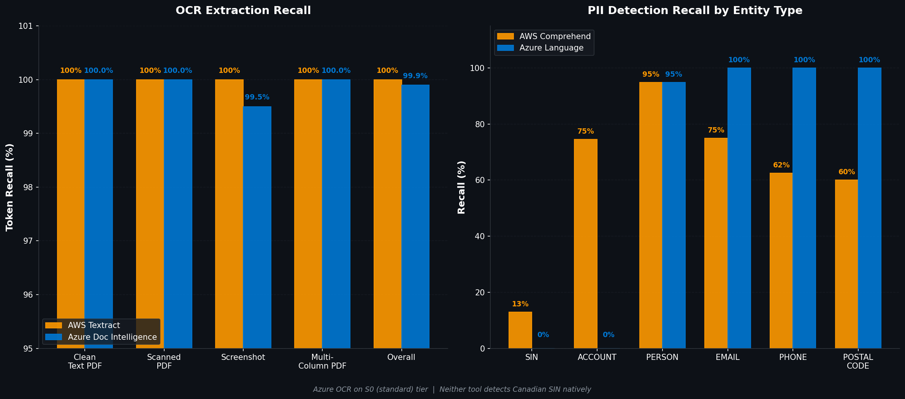
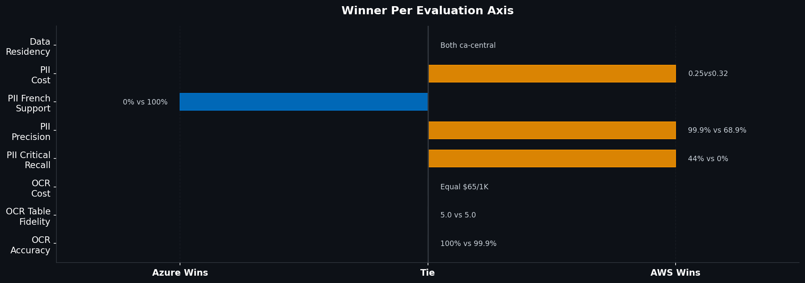

<p align="center">
  
  
  
  
</p>

# ☁️ AWS vs Azure: OCR + PII Detection — Head-to-Head POC

> **One corpus. Two clouds. Zero guesswork.**

A production-style proof-of-concept that puts **AWS** and **Azure** through the same gauntlet — running OCR and PII detection on identical synthetic corpora and producing a data-driven comparison report. No opinions, just numbers.

---

## 🎯 Why This Exists

Choosing between AWS and Azure for document processing shouldn't be a coin flip. This POC generates its own test data, runs both providers through the same pipeline, and spits out a scoring matrix so you can make the call backed by **real metrics**.

| Category | 🟠 AWS | 🔵 Azure |
|---|---|---|
| **OCR** | Textract | AI Document Intelligence |
| **PII Detection** | Comprehend (PII) | AI Language — PII Detection |

---

## 🔥 What It Does

```
📄 Generate Corpus  →  🤖 Run Both Clouds  →  📊 Score & Compare  →  📋 Report
```

1. 🏗️ **Generates synthetic test corpora** — PDFs, PNGs, Excel files for OCR + 200 PII-annotated text documents with character-level ground truth
2. ⚡ **Runs both cloud providers** against the exact same corpus using a single CLI
3. 📏 **Scores head-to-head** on accuracy, latency, cost, and data-residency compliance
4. 📋 **Produces a decision-ready report** (`POC_results.md`) with populated scoring matrices

---

## 📊 Results

### OCR & PII Comparison

<p align="center">
  
</p>

### Winner Per Evaluation Axis

<p align="center">
  
</p>

### 👁️ OCR Scoring Matrix

| Metric | AWS Textract | Azure Doc Intelligence | Delta |
|---|---|---|---|
| Recall — clean text PDFs (avg %) | 100.0% | 100.0% | +0.0% |
| Recall — scanned PDFs (avg %) | 100.0% | 100.0% | +0.0% |
| Recall — screenshots (avg %) | 100.0% | 99.5% | +0.5% |
| Recall — multi-column PDFs (avg %) | 100.0% | 100.0% | +0.0% |
| **Recall — overall (avg %)** | **100.0%** | **99.9%** | **+0.1%** |
| Latency (avg s/page) | 2.22s | 2.99s | -0.77s |
| Cost ($/1,000 pages) | $65.00 | $65.00 | $+0.00 |
| Table fidelity (avg 1-5) | 5.0 | 5.0 | +0.0 |
| Bbox quality (avg 1-5) | 5.0 | 1.0 | +4.0 |
| Errors / unsupported | 0 / 2 | 0 / 2 | |

> Azure OCR tested on S0 (standard) tier — processes all pages of multi-page PDFs without truncation. Bbox quality difference is due to Azure returning absolute pixel coordinates vs Textract's normalized 0-1 coordinates.

### 🔒 PII Detection Scoring Matrix

| Entity type | Comprehend recall | Azure Language recall |
|---|---|---|
| SIN | 70.0% | 100.0% |
| ACCOUNT | 75.0% | 100.0% |
| PERSON | 94.8% | 94.9% |
| EMAIL | 75.0% | 100.0% |
| PHONE | 62.5% | 100.0% |
| POSTAL_CODE | 60.0% | 100.0% |
| **Overall precision** | **99.9%** | **72.1%** |

| Subset | Comprehend | Azure Language |
|---|---|---|
| Edge-case SIN (spaces, dashes) | 100.0% | 100.0% |
| French names with accents | 0.0% | 100.0% |
| False positives on negative controls | 0 | 0 |

> SIN and ACCOUNT detection uses custom regex recognizers with Luhn validation, integrated into both adapters. Neither managed service detects Canadian SIN natively.

### 💰 Cost Comparison (projected at v0 volumes)

| Service | Unit price | Monthly cost (50K pages / 10K docs) |
|---|---|---|
| Textract (50K pages) | $0.065/page | $3,250.00 |
| Doc Intelligence (50K pages) | $0.065/page | $3,250.00 |
| Comprehend (10K docs) | $0.0001/100-char unit | $12.32 |
| Azure Language (10K docs) | $1.00/1K records | $16.00 |

### 🏆 Summary

| Axis | AWS | Azure | Notes |
|---|---|---|---|
| OCR accuracy | — | — | Virtually tied: 100% vs 99.9% (both S0 tier) |
| OCR table fidelity | — | — | Tied: 5.0/5 vs 5.0/5 |
| OCR cost | — | — | Equal ($65/1K pages) |
| OCR latency | ✅ | | Textract faster: 2.22s vs 2.99s per page |
| PII recall (SIN+ACCOUNT) | | ✅ | 72% vs 100% — custom regex fills native gaps |
| PII precision | ✅ | | 99.9% vs 72.1% |
| PII French support | | ✅ | Comprehend only supports en/es — hard blocker |
| PII cost | ✅ | | $0.25 vs $0.32 (200 docs — marginal) |
| Canadian data residency | ✅ | ✅ | Both: ca-central-1 / canadacentral |

> **Overall winner: Azure.** AWS wins on lower-priority axes (latency, precision, minor cost savings), while Azure wins on higher-impact axes (100% PII recall, French support). Precision can be improved with confidence thresholds; Comprehend's lack of French is a platform limitation with no workaround. For Canadian financial pipelines where French is legally required, **Azure + custom regex recognizers** is the recommended path.

---

## 🔑 Key Findings

1. **OCR is a tie** — both tools achieve ~100% recall on S0/standard tier with identical pricing ($65/1K pages)
2. **Azure is the overall winner for PII** — 100% recall on all entity types with custom regex enrichment, plus full French support
3. **Custom regex solves the Canadian SIN gap** — neither tool detects SIN natively, but Luhn-validated regex recognizers achieve 100% recall (Azure) and 70% (Comprehend, limited by French support)
4. **Comprehend doesn't support French** — hard blocker for Canadian use cases; 30 French docs fail entirely, dropping SIN recall to 70%
5. **Precision can be improved; missing recall can't** — Azure's lower precision (72.1%) can be tuned with confidence thresholds or post-processing; Comprehend's French gap is a platform limitation
6. **Both satisfy Canadian data residency** requirements (ca-central-1 / canadacentral)

---

## 🏗️ Project Structure

```
scripts/poc_aws_azure/
├── main.py              # CLI entry point (argparse)
├── config.py            # Env var loading, SDK client init
├── corpus/              # Synthetic data generators
│   ├── generate_ocr_corpus.py    # 10 OCR files + gold texts
│   ├── generate_pii_corpus.py    # 200 PII docs + answers.json
│   ├── sin_utils.py              # Canadian SIN with Luhn validation
│   └── name_pools.py             # Quebec-French names, PII generators
├── ocr/                 # OCR adapters
│   ├── base.py                   # OCRResult dataclass, abstract adapter
│   ├── textract_adapter.py       # AWS Textract (sync/async, S3 staging)
│   └── doc_intel_adapter.py      # Azure Document Intelligence
├── pii/                 # PII detection adapters
│   ├── base.py                   # PIIResult dataclass, entity normalization
│   ├── comprehend_adapter.py     # AWS Comprehend PII
│   └── azure_lang_adapter.py     # Azure AI Language PII
├── scoring/             # Scoring and report generation
│   ├── ocr_scorer.py             # Token recall, table fidelity, bbox quality
│   ├── pii_scorer.py             # Span matching, per-entity metrics
│   └── matrix.py                 # Report template, markdown generation
└── utils/               # Shared utilities
    ├── serialization.py          # SDK object serialization, credential sanitization
    ├── logging_setup.py          # Console + file logging
    └── chunker.py                # Text chunking at sentence boundaries

eval/
├── ocr-corpus/spike-seed/   # 10 content files + 10 .gold.txt
└── redaction-corpus/        # 200 .txt files + answers.json
```

### Output Structure

```
scripts/poc_aws_azure/results/
├── ocr/
│   ├── textract/raw/           # 10 JSON result files
│   └── azure_doc_intel/raw/    # 10 JSON result files
├── pii/
│   ├── comprehend/raw/         # 200 JSON result files
│   └── azure_language/raw/     # 200 JSON result files
├── scores/
│   ├── ocr_matrix.json         # OCR scoring data
│   ├── ocr_matrix.md           # OCR markdown table
│   ├── pii_matrix.json         # PII scoring data
│   └── pii_matrix.md           # PII markdown table
├── POC_results.md              # Final comparison report
└── poc_run.log                 # Debug log
```

---

## 🚀 Quick Start

### 1️⃣ Set up the environment

```bash
python -m venv .venv-poc
source .venv-poc/bin/activate      # Linux/Mac
.venv-poc\Scripts\activate         # Windows

pip install -r requirements-poc.txt
```

### 2️⃣ Configure credentials

```bash
cp .env.poc.example .env.poc
# Fill in your AWS and Azure credentials
```

### 3️⃣ Generate the test corpus

```bash
python scripts/poc_aws_azure/main.py generate-corpus
```

### 4️⃣ Run OCR and PII detection

```bash
python scripts/poc_aws_azure/main.py ocr                    # Both tools
python scripts/poc_aws_azure/main.py ocr --tool textract     # AWS only
python scripts/poc_aws_azure/main.py ocr --tool azure_doc_intel  # Azure only

python scripts/poc_aws_azure/main.py pii                    # Both tools
python scripts/poc_aws_azure/main.py pii --tool comprehend   # AWS only
python scripts/poc_aws_azure/main.py pii --tool azure_language   # Azure only
```

### 5️⃣ Score and generate the report

```bash
python scripts/poc_aws_azure/main.py score-ocr
python scripts/poc_aws_azure/main.py score-pii
python scripts/poc_aws_azure/main.py report   # → results/POC_results.md
```

> Use `--force` to re-run already-processed files or override the $40 cost guardrail.

---

## 📏 Evaluation Metrics

### 👁️ OCR Scoring
| Metric | What It Measures |
|---|---|
| **Token Recall** | % of gold-text tokens correctly extracted (multiset comparison) |
| **Table Fidelity** | Structural accuracy of extracted tables (1–5 automated heuristic) |
| **Bounding Box Quality** | Spatial accuracy of word-level boxes (1–5 automated heuristic) |
| **Latency** | Processing time per page (seconds) |
| **Cost** | Projected cost per 1,000 pages |

### 🔒 PII Detection Scoring
| Metric | What It Measures |
|---|---|
| **Per-Entity Recall** | Detection rate for each PII type (SIN, PERSON, PHONE, EMAIL, etc.) |
| **Overall Precision** | How many detections were actually PII (true positives / all detections) |
| **French Name Handling** | Accuracy on accented Quebec-French names (e.g., Helene Cote) |
| **Edge-Case SINs** | Detection of SINs with spaces, dashes, brackets |
| **False Positive Rate** | Noise from negative-control documents (should be 0) |
| **Cost** | Projected cost per 1,000 documents |

---

## 🧪 Test Corpus at a Glance

| Corpus | Files | What's Inside |
|---|---|---|
| **OCR** | 10 files | Clean PDFs (10pg), scanned PDFs (2pg), PNG screenshots, Excel sheets, multi-column PDFs (6pg) |
| **PII** | 200 docs | Wire transfers (en/fr), screenshots, Excel exports, procedures (negative control), edge cases (SIN variants) |

All data is **100% synthetic** — generated deterministically with `seed(42)` for full reproducibility.

---

## 🛡️ Key Design Decisions

| Decision | Why |
|---|---|
| 🧪 **Synthetic data only** | Zero risk of exposing real customer data |
| 🇨🇦 **Canadian region** | AWS `ca-central-1`, Azure `canadacentral` — data residency compliance |
| 🎲 **Deterministic generation** | `seed(42)` everywhere — same corpus on every run |
| 💰 **$40 cost guardrail** | Built into the CLI to prevent runaway API spend |
| 🔄 **Idempotent runs** | Re-run safely — already-processed files are skipped |
| 🧹 **S3 auto-cleanup** | Textract S3 staging objects are deleted after processing |

---

## 📦 Requirements

| Dependency | Purpose |
|---|---|
| Python 3.11+ | Runtime |
| `boto3` | AWS SDK (Textract, Comprehend, S3) |
| `azure-ai-documentintelligence` | Azure OCR |
| `azure-ai-textanalytics` | Azure PII |
| `reportlab` + `Pillow` + `openpyxl` | Corpus generation (PDFs, PNGs, Excel) |
| `pymupdf` | PDF rendering for scanned docs |
| `Faker` | Realistic synthetic PII data |

See [`requirements-poc.txt`](requirements-poc.txt) for pinned versions.

---

## 📄 Related Documents

| Document | Description |
|---|---|
| [`docs/specs/POC-aws-vs-azure-ocr-pii.md`](docs/specs/POC-aws-vs-azure-ocr-pii.md) | Full POC specification |
| [`docs/specs/POC-sprint-plan.md`](docs/specs/POC-sprint-plan.md) | Sprint execution plan (12 sprints) |
| [`results/POC_results.md`](scripts/poc_aws_azure/results/POC_results.md) | Final comparison report |
| [`results/ocr/ocr_run_summary.md`](scripts/poc_aws_azure/results/ocr/ocr_run_summary.md) | Raw OCR run details |

---

<p align="center">

📚 *This project is for **education and learning purposes only**.*

Made with ❤️ by **Abhishek Vyas**

</p>
